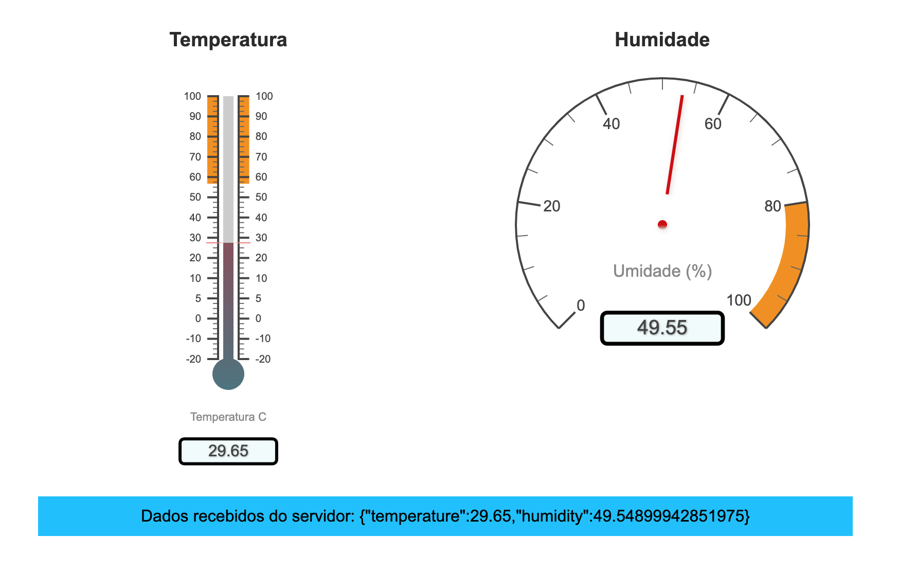

## Server-sent Events

Server-sent Events é uma tecnologia `server push`, ou seja, que o servidor empurra dados para o front-end de forma automática pelo protocolo HTTP. 

Em algumas situações precisamos que o servidor envie dados para o front-end, para atualizações em "tempo real" de alguma coisa. 
Podemos utilizar desde um simples GET a todo momento, o famoso AJAX, como podemos fazer uma conexão do tipo long polling ou até algo mais sofisticado como websocket, que de fato mantem uma conexão multi-direcinal entre cliente s servidor. Porém esta última para coisas mais simples torna-se um grande problema. 
O SSE pode ser uma solução muito simples para receber dados do servidor em tempo real. A implementação é muito simples.

O interessante que não precisa instalar NENHUMA dependência ou pacote do servidor, como nos front.

Dentre diversos usos e exemplos encontrados, para agilizar, utilizei um dashboard para IOT onde foi criado 2 funções no servidor para simular um sensor de temperatura e outro de umidade, assim replicar de forma simples o tutorial referenciado.

### Especificação

- [Mozilla - Server-sent events
](https://developer.mozilla.org/en-US/docs/Web/API/Server-sent_events)

### Compatibilidade

- [Navegadores e versões compatíveis](https://developer.mozilla.org/en-US/docs/Web/API/EventSource#browser_compatibility)

### Executando

Baixando PoC SSE:
```sh
❯ git clone module github.co/pineli/server-sent-events.go
````
Executando:
```sh
❯ cd server-sent-events.go
❯ go run cmd/main.go
  Servidor executando na porta 8081
````

Abrindo navegador `localhost:8081`



### Onde a mágica acontece

A simplicidade da implementação não deixa ir muito além dos exemplos da documentação e das refências encontradas.

#### frontend

Somente estas duas linhas são necessárias, para funcionar:
- necessário instanciar o EventSource;
- e adicionado para 'ouvir' o evento enviado pelo servidor.


```js
const eventSource = new EventSource('/sensor-data-events');
eventSource.addEventListener('sensor-data', (e) => {
    var jsonData = JSON.parse(e.data);
    console.log(jsonData);
});
```

#### Backend

No back-end você precisa apenas:

- Definir os headers;
- 'imprimir' uma string com a definição do `evento`;
- 'imprimir' uma string com a definição dos dados a ser enviado (detalhe importante, colocar os dois \n\n);
- e no final, fazer o flush.

```go
http.HandleFunc("/sensor-data-events", func(w http.ResponseWriter, r *http.Request) {
	w.Header().Set("Content-Type", "text/event-stream")
	w.Header().Set("Cache-Control", "no-cache")
	w.Header().Set("Connection", "keep-alive")
	for {
		dataString, _ := json.Marshal(getSensorValues())
		fmt.Fprintf(w, "event: sensor-data\n")
		fmt.Fprintf(w, "data: %s\n\n", dataString)
		w.(http.Flusher).Flush()
		time.Sleep(1000 * time.Millisecond)
	}
})
```


### Referências

- [Wikipedia - Server-sent events
](https://en.wikipedia.org/wiki/Server-sent_events)
- [Mozilla - Server-sent events](https://developer.mozilla.org/en-US/docs/Web/API/Server-sent_events)
- [Canvas Gauge](https://canvas-gauges.com/documentation/examples/)
- [ESP32 Web Server: Display Sensor Readings in Gauges](https://randomnerdtutorials.com/esp32-web-server-gauges/)
- [Full Cycle - Server-Sent Events (SSE): Comunicação em tempo real
](https://www.youtube.com/watch?v=5TN9cyGev1M&t=4s)


